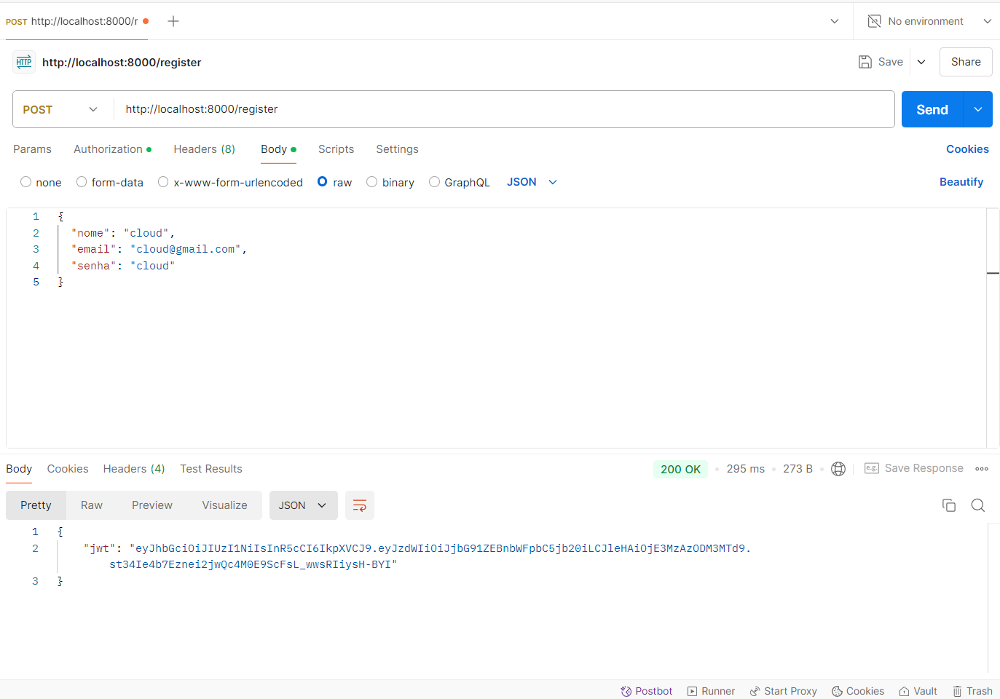
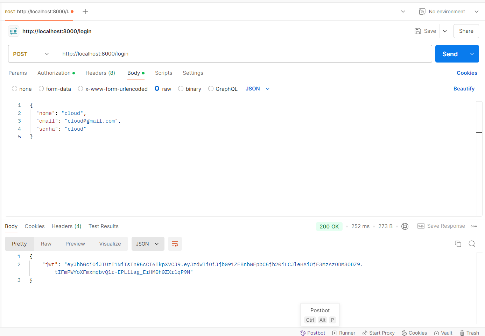
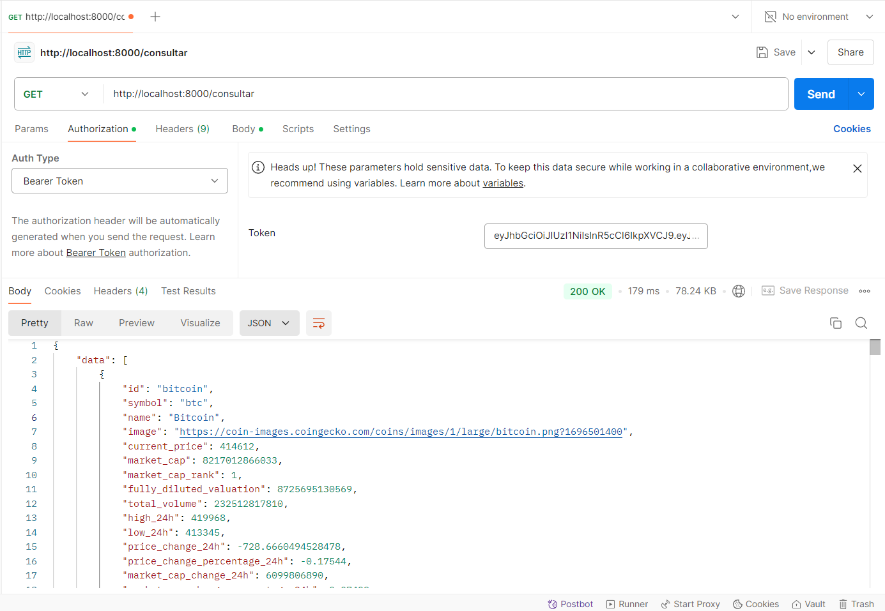

# Projeto-Cloud

Thiago Torres Victoriano

# Documentação do Projeto

## Visão Geral

Este projeto é projeto construído com FastAPI e SQLModel. O sistema permite que os usuários se registrem, façam login e recebam informações relativas às principais cryptocurrencies por meio da API externa da coingecko. As funcionalidades incluem:

- Cadastro e autenticação de usuários
- Acesso às informações das principais criptomoedas

### Pré-requisitos
---
Antes de instalar e executar o projeto, você precisa ter os seguintes itens instalados em seu sistema:

- **Docker**: Para criar e gerenciar containers. Você pode baixar o Docker [aqui](https://www.docker.com/get-started).
- **Docker Compose**: Para facilitar a orquestração de múltiplos containers.

## Tecnologias Utilizadas

- **Backend**: FastAPI
- **Banco de Dados**: MySQL
- **ORM**: SQLModel
- **Autenticação**: JWT
- **Docker**: Para containerização
- **Python**: 3.10

# Docker Hub

Link para o repositório: [thiagovic/projeto](https://hub.docker.com/repository/docker/thiagovic/projeto/general)

## Comandos Utilizados

```bash
docker login
docker tag mysql:5.7 thiagovic/projeto:latest
docker push thiagovic/projeto:latest
```

## Arquivo yaml

O arquivo compose.yaml se encontra na raiz do repositório, na mesma localização que o README.md, baixe-o ou simplesmente crie um arquivo próprio compose.yaml com o seguinte código:
```bash
name: projeto

services:
  web:
    image: thiagovic/projeto:latest
    ports:
      - "8000:8000"
    environment:
      MYSQL_USER: ${MYSQL_USER:-root}    
      MYSQL_PASSWORD: ${MYSQL_PASSWORD:-root} 
      MYSQL_HOST: ${MYSQL_HOST:-db:3306}
      MYSQL_DB: ${MYSQL_DB:-projeto} 
    restart: always
    depends_on:
      - db

  db:
    image: mysql:5.7
    environment:
      MYSQL_ROOT_PASSWORD: ${MYSQL_PASSWORD:-root}
      MYSQL_DATABASE: ${MYSQL_DB:-projeto}

    ports:
      - "3307:3306"
```

## Instalação

1. **Clone o repositório**:
   ```bash
   git clone <URL do repositório>
   cd <nome do repositório>
   ```

2. **Construa e inicie os containers**:
   ```bash
   docker-compose up
   ```

3. **Acesse a aplicação** em `http://localhost:8000`.

## Uso

Após iniciar a aplicação, você pode usar os seguintes endpoints da API:

## Endpoints

### 1. Registro de Usuário

- **Método:** `POST`
- **Endpoint:** `/register`
- **Descrição:** Registra um novo usuário no sistema.
- **Corpo da Requisição:**
  ```json
  {
    "nome":  "string",
    "email": "string",
    "senha": "string"
  }
  ```
- **Resposta:**
  - **200 OK**: Retorna um token JWT.
  - **400 Bad Request**: Dados inválidos.

### 2. Login

- **Método:** `POST`
- **Endpoint:** `/login`
- **Descrição:** Autentica um usuário e retorna um token JWT.
- **Corpo da Requisição:**
  ```json
  {
    "email": "string",
    "senha": "string"
  }
  ```
- **Resposta:**
  - **200 OK**: Retorna um token JWT.
  - **401 Unauthorized**: Credenciais inválidas.

### 3. Consultar Api Externa

- **Método:** `GET`
- **Endpoint:** `/consultar`
- **Descrição:** Retorna uma lista de informações das principais cripto moedas.
- **Cabeçalho:**
  - `Authorization: Bearer {token}`
- **Resposta:**
  - **200 OK**: Retorna uma lista de dados.
  - **401 Unauthorized**: Token inválido ou não fornecido.

## Exemplo de Uso com cURL

### Register

```bash
curl -X POST http://localhost:8000/register \
     -H "Content-Type: application/json" \
     -d '{"nome": "teste", "email": "teste@email.com", "senha": "teste"}'
```



### Login

```bash
curl -X POST http://localhost:8000/login \
     -H "Content-Type: application/json" \
     -d '{"email": "teste@email.com", "senha": "teste"}'
```



### Requisição com Header de Autorização

Após o login, você deve incluir o token JWT nas requisições para endpoints protegidos:

```bash
curl -X GET http://localhost:8000/consultar \
     -H "Authorization: Bearer <seu_token_jwt>"
```



### Video demonstrando as end points 📺
---
https://youtu.be/bvK75yAwn78?feature=shared

# AWS

## Documentação do Projeto - Kubernetes e AWS EKS

Este documento descreve o processo de implantação de uma aplicação e banco de dados utilizando o Kubernetes no Amazon EKS (Elastic Kubernetes Service).

## 1. **Configuração Inicial do EKS**

### 1.1 Criação do Cluster EKS

- Foi criado um cluster EKS na região **sa-east-1**.
- O cluster foi configurado para utilizar nós EC2, com a criação de duas instâncias do tipo **m5.large** para o cluster.

### 1.2 Configuração do AWS CLI e `kubectl`

- O **AWS CLI** foi instalado e configurado utilizando as credenciais do usuário.
- O comando `aws eks update-kubeconfig --region sa-east-1 --name Eks` foi usado para configurar o arquivo kubeconfig e estabelecer a conexão com o cluster EKS.

## 2. **Implantação da Aplicação e Banco de Dados no Kubernetes**

### 2.1 Estrutura do Projeto

A aplicação foi dividida em dois serviços:
1. **Aplicação Web** - Aplicação Python (FastAPI) que está sendo executada com o servidor Uvicorn.
2. **Banco de Dados** - Banco de dados MySQL 5.7 utilizado pela aplicação.

### 2.2 Definição dos Arquivos YAML

#### 2.2.1 **db.yaml**

```yaml
apiVersion: apps/v1
kind: Deployment
metadata:
  name: db-deployment
spec:
  replicas: 1
  selector:
    matchLabels:
      app: db
  template:
    metadata:
      labels:
        app: db
    spec:
      containers:
        - name: db
          image: mysql:5.7
          ports:
            - containerPort: 3306
          env:
            - name: MYSQL_ROOT_PASSWORD
              value: "root_password"
            - name: MYSQL_DATABASE
              value: "projeto"

---
apiVersion: v1
kind: Service
metadata:
  name: db-service
spec:
  selector:
    app: db
  ports:
    - protocol: TCP
      port: 3306
      targetPort: 3306
  type: ClusterIP
```

#### 2.2.2 **web.yaml**

```yaml
apiVersion: apps/v1
kind: Deployment
metadata:
  name: web-deployment
spec:
  replicas: 1
  selector:
    matchLabels:
      app: web
  template:
    metadata:
      labels:
        app: web
    spec:
      containers:
        - name: web
          image: thiagovic/projeto:latest
          ports:
            - containerPort: 8000
          env:
            - name: MYSQL_USER
              value: "root"
            - name: MYSQL_PASSWORD
              value: "root_password"
            - name: MYSQL_HOST
              value: "db-service"
            - name: MYSQL_DB
              value: "projeto"

---
apiVersion: v1
kind: Service
metadata:
  name: web-service
spec:
  selector:
    app: web
  ports:
    - protocol: TCP
      port: 80
      targetPort: 8000
  type: LoadBalancer
```

### 2.3 Explicação dos Arquivos YAML

- **Deployments**: Configuraram o número de réplicas dos pods, bem como as variáveis de ambiente (como credenciais do banco de dados).
- **Services**:
  - O `web-service` é exposto através de um **LoadBalancer** para tornar a aplicação acessível externamente na porta 80, que é mapeada para a porta 8000 no pod da aplicação.
  - O `db-service` é utilizado para expor o banco de dados MySQL internamente no cluster, utilizando a porta 3306.

### 2.4 Aplicação dos Arquivos no Cluster

- Os arquivos YAML foram aplicados no cluster EKS utilizando o comando:
  ```bash
  kubectl apply -f /k8s
  ```

## 3. **Monitoramento e Gerenciamento de Pods e ReplicaSets**

### 3.1 Verificação de Pods e ReplicaSets

Os comandos a seguir foram utilizados para monitorar o status dos pods e ReplicaSets:

- Para verificar o status dos pods:
  ```bash
  kubectl get pods
  ```
- Para verificar o status dos ReplicaSets:
  ```bash
  kubectl get replicaset
  ```

## 4. **Exposição Externa da Aplicação**

### 4.1 Serviço `web-service`

A aplicação foi exposta externamente através de um `Service` com tipo **LoadBalancer**. Isso cria um IP externo para acessar a aplicação.

O comando para verificar o `EXTERNAL-IP` foi:

```bash
kubectl get service web-service
```

### 4.2 Testes de Acesso

A aplicação foi acessada externamente utilizando o IP fornecido pelo LoadBalancer, testando a conectividade via HTTP (porta 80) e confirmando o funcionamento da aplicação no endereço:

```bash
curl http://a827cc135f72c492e8c8a4e8b4cd7392-568558908.sa-east-1.elb.amazonaws.com
```

## 5. **Considerações Finais**

- O cluster EKS foi configurado com duas instâncias EC2 para hospedar os pods.
- A aplicação foi configurada para usar o MySQL como banco de dados e foi exposta externamente através de um LoadBalancer.
- O processo de implantação do Kubernetes foi realizado com sucesso, e as aplicações estão acessíveis externamente.

### Video demonstrando o EKS 📺
---
#### https://youtu.be/RsW1SgRbpfY
---
